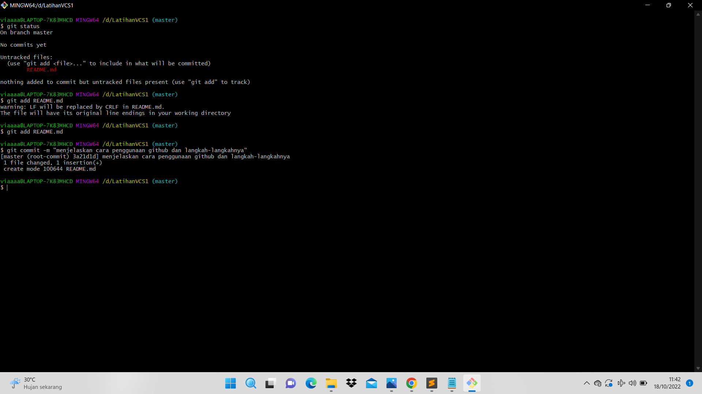

#latihanVCS1

- Menjelaskan Cara Menggunakan GIT Beserta Langkah-Langkahnya -

1. Pastikan kita sudah mendowload aplikasi GITnya(git-scm.com)

2. Masukan Ke web GitHub. Agar GIT kita dapat terhubung dengan GitHub kita harus membuat akun terlebih dahulu 

-Masuk ke web GitHub

- Jika kalian sudah memiliki akun GitHub, silahkan kita bisa langsung Sig In lalu masukan username dan password, tetapi, jika kita belum memiliki akun GitHub. kita bisa klik "creat an account"

- Jika sudah masuk ke GitHub, buatlah sebuah Repository baru dengan cara klik new 

- Kode untuk membuat akun atau menambahkan file README.md

3. Buatlah file Repository di Data D atau penyimpanan lainnya, dengan nama file "latihanVCS"

- Lalu buka file tersebut dengan menggunakan GitBash

- Setelah GitBash dibuka, tambahkan Global Config Repository dengan menggunakan  command:
  git congig --global user.name "FaizahviaFadhillah"
  git config --global user.email "faizahviavadhillah.122@gmail.com"

- Pada file latihanVCS tadi akan di buat menjadi Repository dengan cara:

4. Setelah itu, buatlah sebuah file README.md didalam file Repository yang kita buat tadi

5. Cek file README.md yang sudah kita buat tadi, apakah sudah tercommit atau belum. caranya yaitu :

- git add README.md dan git commit file README.md yang sudah kita buat

6. Cara menambahkan remote server pada git dan mengirim file yang sudah diubah kedalam GitHub Repository

- Prosese Menambahkan Gambar Ke Dalam file README.md Menggunakan Visual Studio Code

